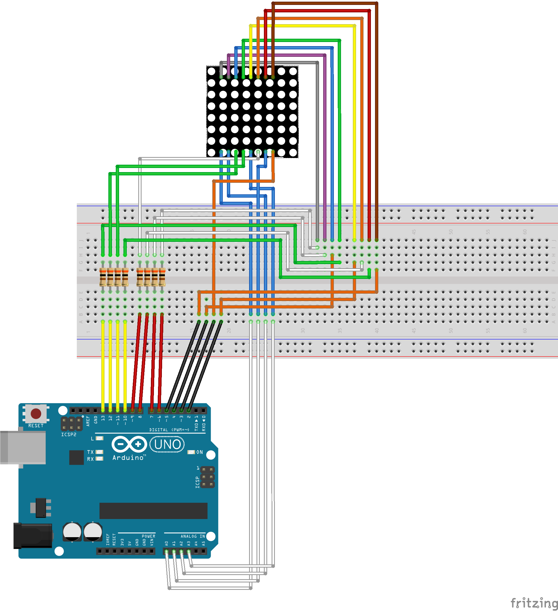
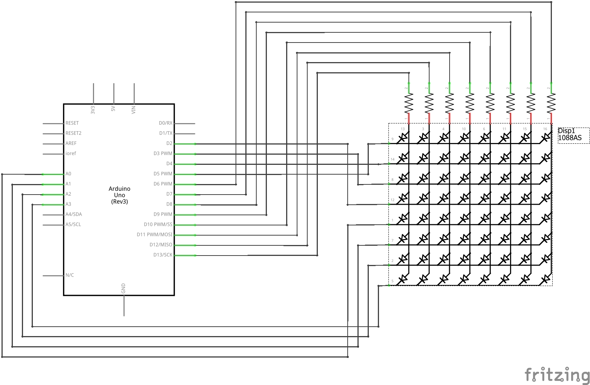

# Prompter project
Small and quick project, for learning basics of arduino.

## Schematics

<p align="left">
Overview and circuit schematics for connecting 8x8 LED matrix to arduino
</p>

<p align="center">



</p>

## How to?

After connecting your arduino to computer, program it using included **prompter.ino**.
Then import **prompter.py** and set port which your arduino occupied as well as baudrate:
```python
import prompter
prompter = prompter.Prompter()
prompter.connect('COM4', baudrate=9600)  # setting up connection
```

Now use ```prompter.run()``` then you will be asked for text to display, just write what you want,
hit enter and watch those letters going :eyes:.

### Limit multiplicity

To limit how many times you want your text to be shown, enter your limit while using **run** command 
```prompter.run(100)```. This will make your text to display 100 time.

### Supported letters

Here's list of supported letters (including space):
```
1234567890QWERTYUIOPASDFGHJKLZXCVBNMĄĆĘŁŃÓŚŻŹ
```

## Author

:pen: Maksymilian Dziemiańczuk  :email: md.dziem@gmail.com